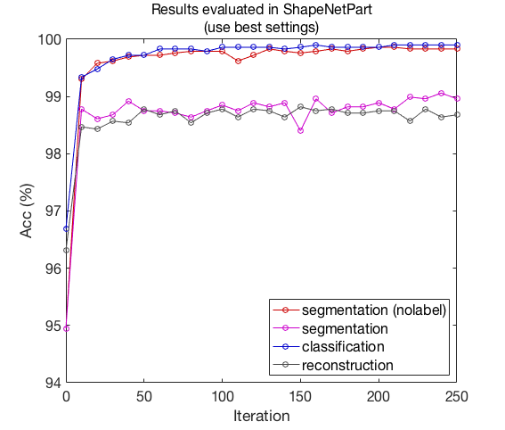
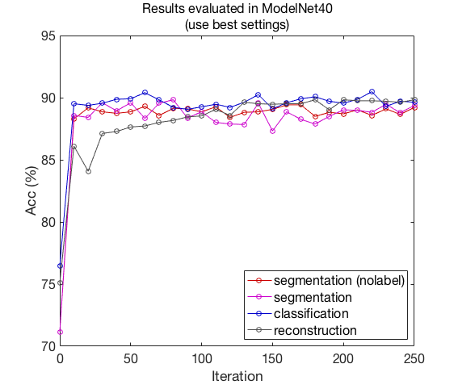
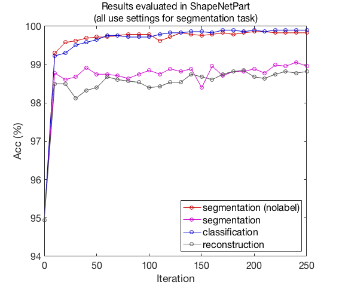
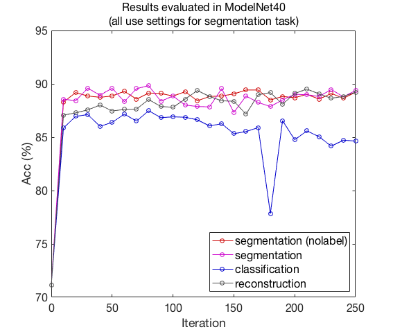
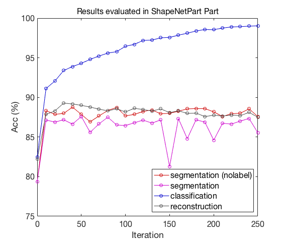

# Point Cloud Segmentation for Classific Feature Learning
## Introduction
This work aims to show whether learning a point cloud segmentation task is able to extract features performing well in classification. We do all experiments under the framework of DGCNN.

Details for DGCNN see **Dynamic Graph CNN for Learning on Point Clouds** (https://arxiv.xilesou.top/pdf/1801.07829). We provide a PyTorch reimplementation for DGCNN in [AnTao97/dgcnn.pytorch](https://github.com/AnTao97/dgcnn.pytorch). 

DGCNN provides two type of networks, one for classification and one for segmentation. We use "DGCNN_Cls" to denote network for classification and "DGCNN_Seg" for segmentation. The network sturcture of DGCNN is
<p float="left">
    
</p>

We also do experiments to see whether learning segmentation on meaningful point clouds assembled by some base point clouds can help to learning better features for base point clouds. To run the experments, we first seperate segmentation parts of each shape from ShapeNetPart dataset as new shapes and make this new dataset as ShapeNetPart Part dataset. Then, we train network on ShapeNetPart dataset as normal and test it on ShapeNetPart Part dataset.

Some visualized point clouds in our ShapeNetPart Part dataset:
<p float="left">
    
    
    
</p>
&emsp;&emsp;&emsp;&emsp;&emsp;&emsp;chair&emsp;&emsp;&emsp;&emsp;&emsp;&emsp;&emsp;&emsp;&emsp;&emsp;&ensp;skateboard&emsp;&emsp;&emsp;&emsp;&emsp;&emsp;&emsp;&emsp;&emsp;&emsp;&ensp;airplane

Experimental results show that learning point cloud segmentation does help to extract features suitable for classification.

**The key contributions of this work are as follows:**

- Since the network provided by DGCNN for segmentation is supervised, we provide an revised DGCNN segmentation network with no category label.
- When segmentation is trained and tested on intact point clouds, the trained model can help to extract better features.
- When segmentation is trained on intact point clouds and tested on base point clouds, the trained model also can help to extract better features. 

If you find this work useful, please cite:
```
@article{tao2020,
      Author = {An Tao},
      Title = {Point Cloud Segmentation for Classific Feature Learning},
      Journal = {https://github.com/AnTao97/PointCloudSegmentation},
      Year = {2020}
}
```
For more our works on point cloud feature learning, see this [repo](https://github.com/AnTao97/PointCloudFeatureLearning).

&nbsp;
## Requirements
- Python 3.7
- PyTorch 1.2
- CUDA 10.0
- Package: glob, h5py, tensorflow, tensorboard, tensorboardX and sklearn

&nbsp;
## Download datasets
Download the HDF5 format datasets (where each shape is sampled 2,048 points uniformly):

- ShapeNetPart (338M)&ensp;[[TsinghuaCloud]](https://cloud.tsinghua.edu.cn/f/c25d94e163454196a26b/)&ensp;[[BaiduDisk]](https://pan.baidu.com/s/1yi4bMVBE2mV8NqVRtNLoqw)
- ShapeNetPart Part (450M)&ensp;[[TsinghuaCloud]](https://cloud.tsinghua.edu.cn/f/b6ee6e3b345744889e6b/)&ensp;[[BaiduDisk]](https://pan.baidu.com/s/1uCotFveZ5R5ztRPIm1hfJQ)
- ModelNet40 (194M)&ensp;[[TsinghuaCloud]](https://cloud.tsinghua.edu.cn/f/b3d9fe3e2a514def8097/)&ensp;[[BaiduDisk]](https://pan.baidu.com/s/1NQZgN8tvHVqQntxefcdVAg)

You can find more details about the above datasets in this [repo](https://github.com/AnTao97/PointCloudDatasets).

&nbsp;
## Experiment settings
To evaluate the quality of extracted features, we use ShapeNetPart dataset to both train DGCNN and a linear SVM classifier. Specifically, we train the linear SVM classifier on ShapeNetPart dataset using the features (latent representations) obtained from the trained feature encoder. 

For transfer performance, we train the linear SVM classifier on ModelNet 40 dataset using the features (latent representations) obtained from the same network trained from the ShapeNetPart dataset.

In this work we compare the performance for adopted training task among supervised segmentation, supervised segmentation without category label, supervised classification and unsupervised reconstruction. For supervised segmentation without category label, we discard the adding of categorical vector (mlp {64}) and directly repeat the 1024 dim feature into n x 1024. We do unsupervised reconstruction following the framework in this [repo](https://github.com/AnTao97/UnsupervisedPointCloudReconstruction) and use source points from sphere surface for decoder. We also change feature dimension into 1024. Except unsupervised reconstruction, we do all experiments under the framework of DGCNN.

To train the network, run
```
python main.py --exp_name <exp name> --task <segment | classify | reconstruct> --dataset_root <root directory for datasets> --encoder <dgcnn_cls | dgcnn_seg> --k <20 | 40> --feat_dims 1024 --batch_size <16 | 32> --dataset shapenetpart --gpu <gpu ids>
```
Use `--seg_no_label` if you want to run segmentation task without category label.

You can download our already trained models from [[Dropbox]](https://www.dropbox.com/sh/54pv3iki2lwytes/AAAvHVDtS7sTFj3zbnf9ta-Ja?dl=0) or [[BaiduDisk]](https://pan.baidu.com/s/1UigbY4jNts8LMZ6fqJXvxQ) and place them under `snapshot/`.

Because this work is done before our PyTorch reimplementation for DGCNN, the training setting in this repo is slightly different with [AnTao97/dgcnn.pytorch](https://github.com/AnTao97/dgcnn.pytorch). You can set `self.epochs = 200` and `random_translate=False` in line 61 and 120 in `segmentation.py` to follow the settings in [AnTao97/dgcnn.pytorch](https://github.com/AnTao97/dgcnn.pytorch). 

Besides ShapeNetPart dataset, we also test the performace of linear SVM classifier on ShapeNetPart Part dataset, using the model trained on ShapeNetPart dataset with segmentation task. 

To evaluate the performance of a given trained model, run
```
python main.py --eval --model_path <model path> --task <segment | classify | reconstruct> --dataset_root <root directory for datasets> --encoder <dgcnn_cls | dgcnn_seg> --k <20 | 40> --feat_dims 1024 --dataset <shapenetpart | modelnet40 | shapenetpartpart> --gpu <gpu ids> 
```

Use `--no_cuda` if you want to run in CPU.

To use Tensorboard, run 
```
tensorboard --logdir tensorboard --bind_all
```
You can find the Tensorboard records under `tensorboard/`.

&nbsp;
## Classification accuracy of linear SVM classifier 
### Results with best settings
| Task | Info | Encoder | K | Batch Size | Epochs | ShapeNetPart | ModelNet40 | 
| :---: | :---: | :---: | :---: | :---: | :---: | :---: | :---: | 
| Segmentation | Supervised | DGCNN_Seg | 40 | 32 | 250 | 98.9% | 89.4% | 
| Segmentation | Supervised (no category label) | DGCNN_Seg | 40 | 32 | 250 | **99.9%** | 89.2% | 
| Classification | Supervised | DGCNN_Cls | 40 | 32 | 250 | 99.8% | 89.6% | 
| Reconstruction | Unsupervised | DGCNN_Cls | 20 | 16 | 250 | 98.7% | **89.8%** | 

&nbsp;
<p float="left">
    
    
</p>

&nbsp;
### Results with settings for segmentation task
| Task | Info | Encoder | K | Batch Size | Epochs | ShapeNetPart | ModelNet40 | 
| :---: | :---: | :---: | :---: | :---: | :---: | :---: | :---: | 
| Segmentation | Supervised | DGCNN_Seg | 40 | 32 | 250 | 98.9% | **89.4%** | 
| Segmentation | Supervised (no category label) | DGCNN_Seg | 40 | 32 | 250 | **99.9%** | 89.2% | 
| Classification | Supervised | DGCNN_Seg | 40 | 32 | 250 | **99.9%** | 86.8% | 
| Reconstruction | Unsupervised | DGCNN_Seg | 40 | 32 | 290 | 98.8% | 89.2% | 

&nbsp;
<p float="left">
    
    
</p>

&nbsp;
### Results evaluated on ShapeNetPart Part dataset
| Task | Info | Encoder | K | Batch Size | Epochs | Training Dataset | Eval Acc
| :---: | :---: | :---: | :---: | :---: | :---: | :---: | :---: | 
| Segmentation | Supervised | DGCNN_Seg | 40 | 32 | 250 | ShapeNetPart | 85.0% | 
| Segmentation | Supervised (no category label) | DGCNN_Seg | 40 | 32 | 250 | ShapeNetPart | 84.0% | 
| Classification | Supervised | DGCNN_Cls | 40 | 32 | 250 | ShapeNetPart Part | **99.0%** | 4
| Reconstruction | Unsupervised | DGCNN_Cls | 20 | 16 | 250 | ShapeNetPart Part | 87.5% | 

&nbsp;
<p float="left">
    
</p>

&nbsp;
## Performance analysis
Experimental results show that learning point cloud segmentation does help to extract features suitable for classification. However, simply adopting the training scheme from DGCNN for segmentation task is not suitable for transfer learning. We believe better results will get if using better training scheme.

